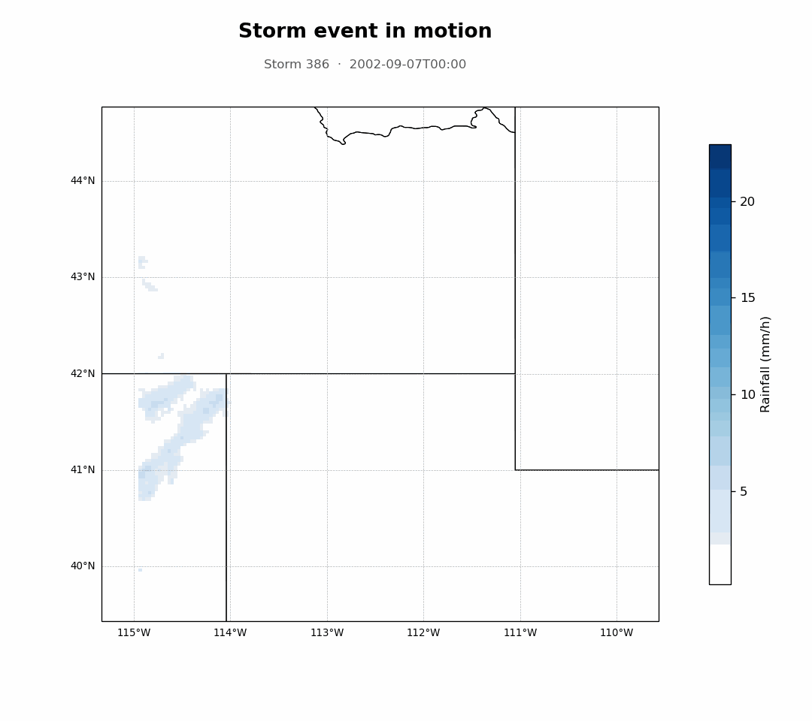

# Storm Motion Analyzer
[](https://www.python.org/downloads/)
[](LICENSE)
 
Storm detection and tracking toolkit for characterizing storm motion from hourly gridded rainfall data. 
 
## Tool description
 
Storm Motion Analyzer detects storm centers within NetCDF gridded rainfall data, tracks their trajectories over time (Lagrangian tracking), and characterizes their motion, intensity, and spatial extent. It supports the research described in *"Mapping the Motion of Historical Extreme Rainfall Events Across CONUS: A Dataset on Storm Tracks, Speed, and Structure"* (Osorio-Giraldo, Perez, Wright, and Liu).
 
It works with storm catalogs from storm generators or rainfall datasets — for example, the catalogs produced by [RainyDay](https://github.com/HydroclimateExtremesGroup/RainyDay).


 
## Quick start
 
**Prerequisites:** Python 3.7+, NetCDF4, and the standard scientific Python stack (NumPy, SciPy, Matplotlib, Pandas).
 
```bash
git clone https://github.com/Perez-HydroSystems/storm-motion-analyzer.git
cd storm-motion-analyzer
 
pip install -r requirements.txt
pip install -e .          # optional: enables the `stormcatalog-analyzer` CLI
```
 
You need two things to run an analysis: a storm event or a storm catalog (a folder of NetCDF events) and a JSON config. All inputs, paths, and model parameters live in one config file — see [`configs/testing_data.json`](configs/testing_data.json).
 
```bash
# Catalog-level diagnostic plots (main deliverable)
python run_diagnostics.py --config configs/testing_data.json
 
# Per-event tracking figures for a single storm (by filename, substring, or id)
python run_diagnostics.py event --config configs/testing_data.json --storm 100
```
 
If installed with `pip install -e .`, the same commands are available as `stormcatalog-analyzer diagnostics|event ...`.
 
Prefer a notebook? Open [`storm_motion_catalog.ipynb`](storm_motion_catalog.ipynb) — it loads the config and runs the same pipeline.
 
## Usage
 
### Python API
 
```python
from stormcatalog_analyzer.config import load_config
from stormcatalog_analyzer import pipeline
 
cfg = load_config("configs/testing_data.json")
cfg.tracking.rainfall_threshold_mmhr = 0.5   # optional inline overrides
 
out = pipeline.run(cfg)                # track -> summarize -> diagnostics
out["summary"].storm_properties.head()
print(out["figures"])                  # saved figure paths
print(out["table"])                    # per-storm properties CSV
```
 
### Outputs
 
Written to `<output_dir>/<domain_name>/`:
 
- `storm_properties_<domain>.csv` — one row per storm: mean speed & direction, mean/peak intensity, total accumulated rainfall, ellipse major/minor axis + angle, area, duration, trajectory length.
- Diagnostic figures: trajectory map + wind rose, direction vectors, statistics pairplot.
### Notebooks
 
| Notebook | Purpose |
|---|---|
| [`storm_motion_catalog.ipynb`](storm_motion_catalog.ipynb) | Main — catalog in, full diagnostic-plot set + per-event figures out. |
| [`notebooks/storm_motion_event.ipynb`](notebooks/storm_motion_event.ipynb) | Per-event spatiotemporal evolution + fitted ellipse. |
| `notebooks/legacy/` | Older exploratory notebooks (unmaintained). |
 
## What it extracts
 
- **Motion** — trajectory, translation speed, direction, temporal evolution of storm paths.
- **Intensity** — peak and mean rainfall intensity, spatial distribution, temporal patterns.
- **Spatial extent** — storm area coverage, shape evolution, regional coverage, areal rainfall distributions.

 

## Authors
 
- Diego F. Osorio-Giraldo, Gabriel Perez — School of Civil and Environmental Engineering, Oklahoma State University


 

 
## License
 
MIT — see [LICENSE](LICENSE).